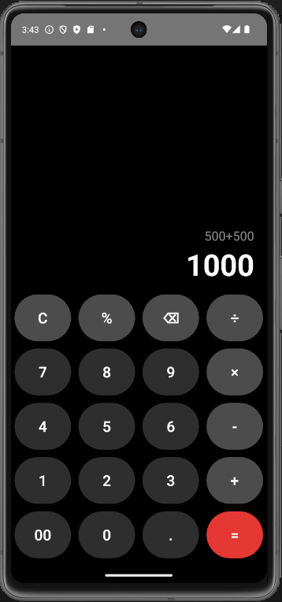

✨ Features..................................

➕ Basic arithmetic operations
(Addition, Subtraction, Multiplication, Division)

🧹 Clear (C) and Backspace (⌫) functionality

📊 Expression preview (shows previous calculation)

🎨 Modern dark UI design

📱 Fully responsive for Android devices

⚡ Fast and lightweight

🛠️ Tech Stack...........................

React Native

JavaScript (ES6+)

React Hooks (useState)

FlatList & TouchableOpacity

Android Emulator / Physical Device

📸 App Preview....................................

  
  

🚀 How to Run the Project Locally.......................

1️⃣ Clone the repository
git clone https://github.com/your-username/react-native-calculator.git
cd react-native-calculator

2️⃣ Install dependencies
npm install

3️⃣ Start Metro bundler
npx react-native start

📂 Project Structure
react-native-calculator/
 ├── android/
 ├── ios/
 ├── App.js
 ├── package.json
 └── README.md

 📂 Project Structure
react-native-calculator/
 ├── android/
 ├── ios/
 ├── App.js
 ├── package.json
 └── README.md
